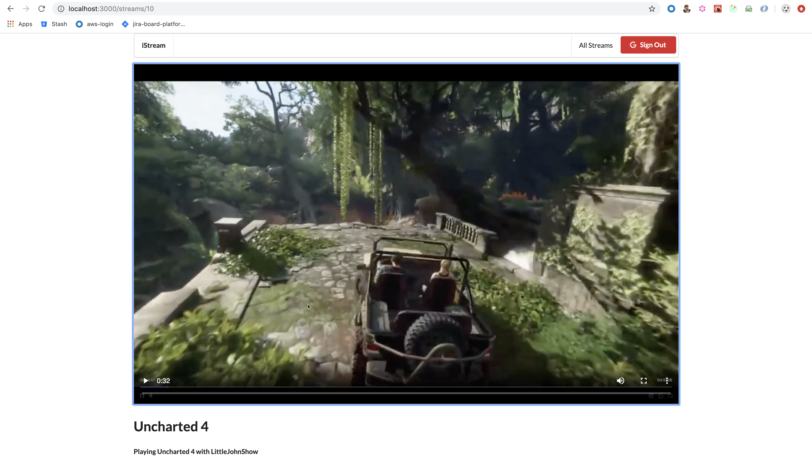

# react-redux-video-streaming-project
This a front-end focused project to stream videos.
- The project is build by using react, redux, react-router, redux-form, axios and uses Google's Auth0 for authentication.
- It uses json-server which acts as a database for the POST and GET requests from axios.
- It also uses node-media-server for streaming videos.

#####Reference
Udemy - Modern React with Redux

##Usage:

1. Go to `api` directory and run `npm start`. This will start the `json-server` for the REST api calls from [http://localhost:3001/streams](http://localhost:3001/streams) endpoint.
2. Go to `client` directory and run `npm start`. This will start the react-redux application on [http://localhost:3000](http://localhost:3000) 
3. Go to `rtmpserver` directory and run `npm start`. This will start the node-media-server on port `1935`

##Running Application Locally
1. Install `OBS` to stream videos and then create a `scene`, add `Display Caputer` and `Audio Input Capture`.
2. In Stream settings change *Service* to `Custom`, *Server* to `rtmp://localhost/live` and use *Stream ID* as `Stream Key`.
3. The mediaDatasource could be changed from localhost to any other streaming media services.

